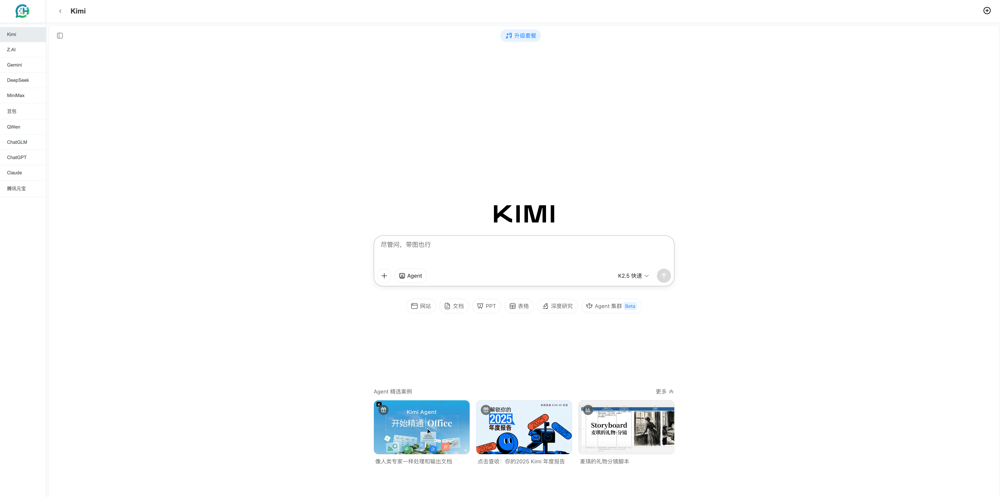

<div align="center">
  
  <h1>ChatHub Chrome Extension</h1>
  <p>一个智能的 Chrome 浏览器扩展，将您的新标签页转换为 AI 助手工作台，聚合多个主流 AI 聊天平台。</p>
  
  <p>
    <!-- Version & License -->
    <a href="https://github.com/beupgo/chatHub/releases">
      
    </a>
    <a href="https://github.com/beupgo/chatHub/blob/main/LICENSE">
      
    </a>
    <!-- Code Size & Last Commit -->
    
    
  </p>
  <p>
    <!-- Build & Issues -->
    <a href="https://github.com/beupgo/chatHub/actions">
      
    </a>
    <a href="https://github.com/beupgo/chatHub/issues">
      
    </a>
    <a href="https://github.com/beupgo/chatHub/pulls">
      
    </a>
  </p>
  <p>
    <!-- Downloads & Rating -->
    <a href="https://chrome.google.com/webstore/detail/your-extension-id">
      
    </a>
    <a href="https://chrome.google.com/webstore/detail/your-extension-id">
      
    </a>
  </p>
  <p>
    <!-- Social -->
    <a href="https://github.com/beupgo/chatHub/stargazers">
      
    </a>
    <a href="https://github.com/beupgo/chatHub/network/members">
      
    </a>
  </p>
</div>

## 目录 (Table of Contents)

- [简介 (Introduction)](#简介-introduction)
- [主要功能 (Features)](#主要功能-features)
- [快速开始 (Quick Start)](#快速开始-quick-start)
- [项目结构 (Project Structure)](#项目结构-project-structure)
- [技术栈 (Tech Stack)](#技术栈-tech-stack)
- [注意事项 (Notes)](#注意事项-notes)
- [参与贡献 (Contributing)](#参与贡献-contributing)
- [许可证 (License)](#许可证-license)

## 简介 (Introduction)

ChatHub 致力于提升您的工作效率，通过接管 Chrome 默认的新标签页，提供一个集成化、可定制的 AI 平台聚合工作台。无需在多个标签页之间频繁切换，在一个界面中即可快速访问和使用主流 AI 模型。



## 主要功能 (Features)

- **新标签页替换** - 自动接管并替换 Chrome 默认新标签页，提供沉浸式体验。
- **多 AI 平台集成** - 默认支持并内置 **Kimi, Z.AI, Gemini, DeepSeek, 豆包, QWen, ChatGLM, ChatGPT, Claude, 腾讯元宝, MiniMax** 等主流 AI。
- **双重打开模式** - 支持 `iframe` 页面内嵌模式和新标签页跳转模式，满足不同平台的使用体验需求。
- **高度可定制** - 自由添加、编辑、删除、拖拽排序您的 AI 平台侧边栏菜单。
- **响应式与交互设计** - 现代化的 UI 界面，支持侧边栏折叠/展开，让您专注于对话内容。
- **本地数据持久化** - 菜单配置和状态自动保存在 Chrome 本地存储，安全无忧，不会丢失您的偏好设置。
- **安全跨域支持** - 利用 `declarativeNetRequest` API 解决部分平台的 iframe 嵌入跨域限制。

## 快速开始 (Quick Start)

### 安装步骤

1. 克隆或下载本项目源码到本地电脑。
   ```bash
   git clone https://github.com/beupgo/chatHub.git
   ```
2. 打开 Chrome 浏览器，在地址栏访问扩展程序管理页面：`chrome://extensions/`
3. 在页面右上角开启 **"开发者模式"**。
4. 点击左上角的 **"加载已解压的扩展程序"**。
5. 选择本项目所在的文件夹，即可完成安装。安装后每次打开新标签页即可看到工作台。


## 项目结构 (Project Structure)

```text
chatHub/
├── manifest.json          # Chrome 扩展配置文件 (Manifest V3)
├── index.html             # 新标签页的主题 UI 页面
├── app.js                 # 核心交互逻辑与状态管理
├── background.js          # Service Worker 后台脚本
├── content-scripts/       # 注入页面的内容脚本
│   └── gemini-fix.js      # 针对特定平台的兼容修复脚本
├── icons/                 # 扩展使用的各尺寸图标资源
├── src/                   # React 源码目录 (如需复杂 UI 可构建打包)
├── package.json           # Node.js 依赖配置
└── README.md              # 项目说明文档
```

## 技术栈 (Tech Stack)

- **[Manifest V3](https://developer.chrome.com/docs/extensions/mv3/intro/)** - 最新一代 Chrome 扩展标准，更安全、性能更好。
- **HTML5 & CSS3** - 原生响应式布局，轻量快速，无需沉重的 UI 框架。
- **Vanilla JavaScript** - 原生 JS 实现高性能的 DOM 操作与业务逻辑。
- **Chrome Storage API** - 轻量级、高效的用户配置持久化。
- **declarativeNetRequest API** - 声明式网络请求拦截，安全修改响应头以支持各大站点的 iframe 嵌入。

## 注意事项 (Notes)

1. 当前版本主要面向开发者或提供本地加载安装使用，请确保在 Chrome **开发者模式** 下进行操作。
2. 受到部分 AI 平台严格的 CSP (Content Security Policy) 和 `X-Frame-Options` 限制，少数平台可能无法完美 iframe 嵌入。系统允许配置并在遇到问题时一键切换至“新标签页打开”模式。
3. 扩展不对您的聊天内容进行任何拦截和上传，所有通信均直接发生于浏览器与目标 AI 平台之间。
4. 请遵守各接入 AI 平台的使用条款及隐私政策。

## 参与贡献 (Contributing)

我们非常欢迎并感谢您对该项目的贡献，欢迎提交 Issue 和 Pull Request！

1. Fork 本仓库
2. 创建您的特性分支 (`git checkout -b feature/AmazingFeature`)
3. 提交您的更改 (`git commit -m 'Add some AmazingFeature'`)
4. 推送到分支 (`git push origin feature/AmazingFeature`)
5. 开启一个 Pull Request

更多详细信息，请参阅我们的 [贡献指南](CONTRIBUTING.md) 和 [行为准则](CODE_OF_CONDUCT.md)。

### 贡献者 (Contributors)

感谢所有参与贡献的人！

<a href="https://github.com/beupgo/chatHub/graphs/contributors">
  
</a>

## 许可证 (License)

本项目基于 [MIT License](LICENSE) 开源。您可以自由地使用、修改和分发，但请注意本项目仅供学习和交流使用，勿用于商业侵权用途。

